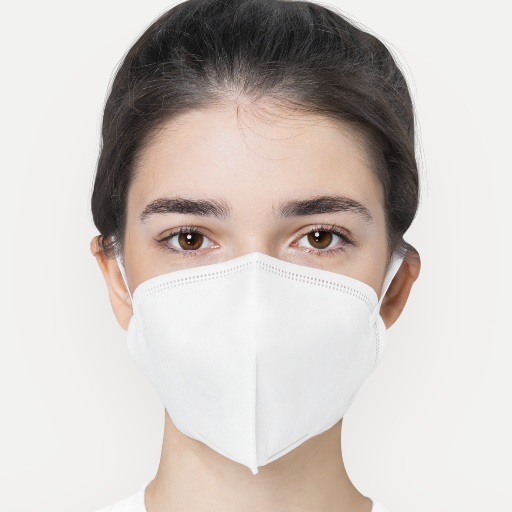

## Usage

### result sample
Input image Mask  Result 

### requirements
```
conda install pytorch torchvision cudatoolkit=11 -c pytorch
conda install matplotlib jinja2 ninja dill mediapipe
```


### inference 

1. download pretrained model using ``download/*.sh" (converted from the tensorflow pretrained model)

e.g. ffhq512

```
./download/ffhq512.sh
```

converted model:
* FFHQ 512 checkpoints/comod-ffhq-512/co-mod-gan-ffhq-9-025000_net_G_ema.pth
* FFHQ 1024 checkpoints/comod-ffhq-1024/co-mod-gan-ffhq-10-025000_net_G_ema.pth

2. use the following command as a minimal example of usage

```
./test.sh
```


## Reference

[1] co-mod-gan pytorch version: https://github.com/zengxianyu/co-mod-gan-pytorch
